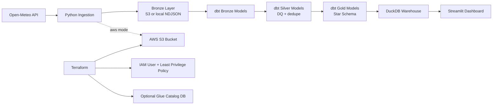
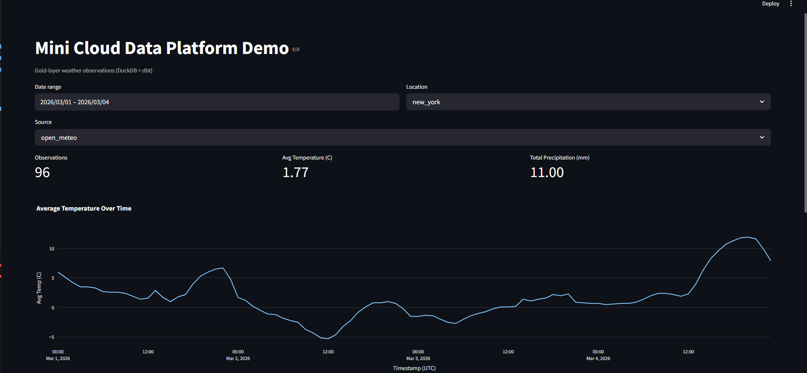

# Mini Cloud Data Platform Demo (AWS + Terraform + Python + dbt + Streamlit)

## Recruiter-Friendly Summary
This repository demonstrates a realistic junior-friendly cloud data platform workflow:
- Infrastructure as Code on AWS (Terraform) with environment-aware naming and tags.
- A Python ingestion pipeline with retries, schema validation, structured logs, local/AWS modes, and fallback data generation.
- Analytics transformations with dbt (DuckDB) from bronze -> silver -> gold.
- A small Kimball-style star schema (`dim_date`, `dim_source`, `dim_location`, `fact_observation`).
- Lightweight dashboarding with Streamlit for KPI and time-series insights.
- Basic CI/CD and engineering hygiene (ruff, black, pytest, dbt tests, pre-commit).

This is intentionally small and cost-aware for portfolio use, not enterprise-scale production.

## Architecture


## Tech Stack
- Python 3.11
- Terraform (AWS provider)
- AWS S3 + IAM (free-tier-friendly usage pattern)
- dbt-core + dbt-duckdb
- DuckDB
- Streamlit + Plotly
- Docker + Docker Compose
- GitHub Actions CI

## Repository Layout
```text
.
|-- .github/workflows/ci.yml
|-- infra/terraform/
|-- pipeline/
|-- dbt/
|-- dashboard/
|-- scripts/
|-- data/
|-- Dockerfile
|-- docker-compose.yml
|-- Makefile
`-- README.md
```

## Quick Start (Local, No AWS Required)
### 1) Prerequisites
- Python 3.11
- GNU Make
- Docker (optional, for containerized workflow)

### 2) Setup
```bash
make setup
```

### 3) Ingest data locally into bronze
```bash
make ingest-local
```

### 4) Build transformations and tests
```bash
make dbt-run
make dbt-test
```

### 5) Launch dashboard
```bash
make dashboard
```

Open http://localhost:8501

## End-to-End One-Liner (Local)
```bash
./scripts/run_all_local.sh
```

## Pipeline Behavior
### Bronze
- Source: Open-Meteo public API (no key required).
- Raw landing format: newline-delimited JSON (`.ndjson`).
- Local mode path: `data/bronze/open_meteo/`.
- AWS mode path: `s3://<bucket>/bronze/open_meteo/date=YYYY-MM-DD/`.

### Silver
- Deduplication by location + observation timestamp.
- Basic quality filters:
  - Temperature in plausible range.
  - Non-negative precipitation.
- Adds business key (`observation_nk`).

### Gold
Kimball-style star schema:
- `dim_date`: one row per calendar day.
- `dim_source`: source system (`open_meteo` or `synthetic_fallback`).
- `dim_location`: tracked city/location metadata.
- `fact_observation`: grain = one location, one observation timestamp, one source.

## Star Schema Details
- Fact grain: hourly weather observation for a location.
- Keys:
  - `fact_observation.observation_key` (hashed natural key).
  - Foreign keys: `date_key`, `location_key`, `source_key`.
- Dimensions:
  - `dim_date` supports time filtering and date rollups.
  - `dim_location` supports location slicing.
  - `dim_source` supports lineage/source transparency.

## AWS Deployment (Terraform)
### 1) Configure variables
```bash
cd infra/terraform
cp terraform.tfvars.example terraform.tfvars
```
Edit `terraform.tfvars` values (`project_name`, `env`, tags, region).

### 2) Init and plan
```bash
terraform init
terraform plan
```

### 3) Apply
```bash
terraform apply
```

### 4) Capture outputs
- `data_lake_bucket_name`
- `pipeline_iam_user_name`
- `pipeline_policy_arn`

Use these values to set environment variables for AWS ingestion:
```bash
export AWS_REGION=us-east-1
export S3_BUCKET=<terraform_output_bucket_name>
make ingest-aws
```

## Environment Separation
- Terraform variable `env` defaults to `dev`.
- Resource names include environment suffix.
- Tags are propagated via `var.tags`.

## Data Quality & Reliability Features
- Retries with exponential backoff for API requests.
- Structured JSON logs for ingestion events.
- Schema contract using `pydantic`.
- Fallback synthetic data generation when API is unavailable.
- dbt tests for `not_null`, `unique`, `accepted_values`, and relationships.

## Dashboard Features
- KPIs:
  - Observation count
  - Average temperature
  - Total precipitation
- Time-series chart of average temperature.
- Filters:
  - Date range
  - Location
  - Source

## CI/CD
GitHub Actions workflow (`.github/workflows/ci.yml`) runs on pull requests:
- Dependency install (`make setup`)
- Lint and format checks (`ruff`, `black --check`)
- Unit tests (`pytest`)
- Local ingestion (`make ingest-local`)
- dbt run/tests (`make dbt-run`, `make dbt-test`)

## Docker Workflow
Build and open a dev container:
```bash
docker compose up -d pipeline
docker compose exec pipeline make ingest-local
docker compose exec pipeline make dbt-run
docker compose exec pipeline make dbt-test
```

Optional Postgres service:
```bash
docker compose --profile postgres up -d postgres
```
`dbt/profiles.yml.example` includes an optional Postgres target template.

## Cost Notes (AWS Free Tier Friendly)
- S3 costs are low at small data volumes; keep data small and clean old files.
- IAM user/policy has no direct cost.
- Glue catalog is optional and disabled by default (`create_glue_catalog=false`).
- This demo avoids always-on compute (no EC2, no managed orchestration service by default).
- Always run `terraform destroy` when done.

## Security Notes
- No secrets are committed.
- AWS credentials are expected from your environment (`AWS_ACCESS_KEY_ID`, `AWS_SECRET_ACCESS_KEY`, optional session token).
- `dbt/profiles.yml` is gitignored; start from `dbt/profiles.yml.example`.


